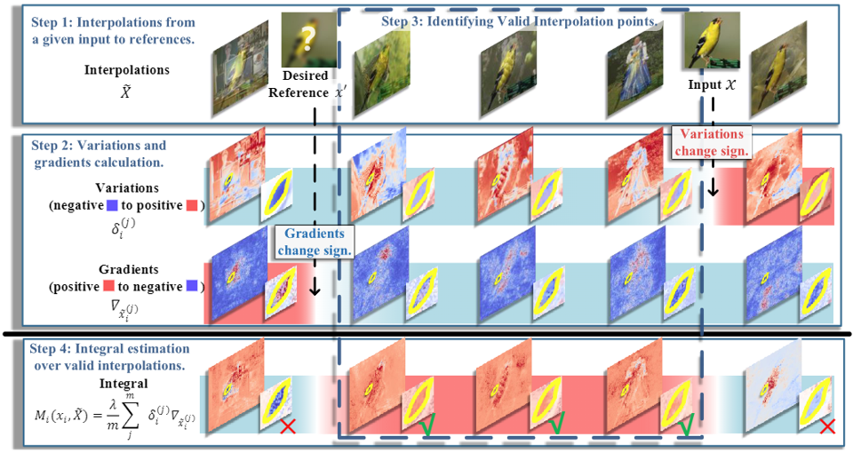

# Re-Calibrating Feature Attributions for Model Interpretation

This code implements attribution re-calibration algorithm from the following paper:

> Peiyu Yang, Naveed Akhtar, Zeyi Wen, Mubarak Shah, and Ajmal Mian
>
> [Re-calibrating Feature Attributions for Model Interpretation](https://scholar.google.com/citations?view_op=view_citation&hl=en&user=Xqmlj18AAAAJ&sortby=pubdate&citation_for_view=Xqmlj18AAAAJ:kzcrU_BdoSEC)


## Abstract

Trustworthy machine learning necessitates meticulous regulation of model reliance on non-robust features. In this paper, we proposed a framework to delineate such features by attributing model predictions to the input. Within this framework, the attributions of robust features exhibit certain consistency, while non-robust features are susceptible to attribution fluctuations. This suggests a strong correlation between model reliance on non-robust features and the smoothness of the marginal density of input samples. Hence, we propose to regularize the gradients of the marginal density w.r.t. the input features. We devise an efficient implementation of our regularization to address the potential numerical instability of the underlying optimization process. In contrast, we reveal that the baseline input gradient regularization smooths the implicit conditional or joint density, resulting in its limited robustness. Experiments validate the effectiveness of our technique through the mitigation of spurious correlation learned by the model and addressing feature leakage. We also demonstrate that our regularization enables the model to exhibit robustness against perturbations in pixel values, input gradients and density, enhancing its desirability for robust modeling.



## Prerequisites

- python 3.9.2
- matplotlib 3.5.1
- numpy 1.21.5
- pytorch 1.12.0
- torchvision 0.13.1

## Re-Calibrating Attributions

### Step 1: Preparing dataset.
```
dataset\IMAGENET
```

### Step 2: Preparing models.
```
pretrained_models\YOUR_MODEL
```

### Step 3: Re-calibrating attributions.

```
python main.py -attr_method=IntGradSG -model resnet34 -dataset ImageNet -metric DiffID -k 5 -bg_size 10
```

## Bibtex
If you found this work helpful for your research, please cite the following papers:
```
@artical{yang2023recalibrating,
    title={Re-Calibrating Feature Attributions for Model Interpretation},
    author={Peiyu, Yang and Naveed, Akhtar and Zeyi, Wen and Mubarak, Shah and Ajmal, Mian},
    booktitle={International Conference on Learning Representations {ICLR}},
    year={2023}
}
```
```
@artical{yang2023local,
    title={Local Path Integration for Attribution},
    author={Peiyu, Yang and Naveed, Akhtar and Zeyi, Wen and Ajmal, Mian},
    booktitle={AAAI Conference on Artificial Intelligence {AAAI}},
    year={2023}
}
```